# No Distraction AI — Development Log

> **Personal browser extension project**  
> A locally-run, AI-powered content blocking tool with an agentic chat interface.  
> Built iteratively across one extended session with Claude.

---

## Table of Contents

1. [Project Summary](#project-summary)
2. [Architecture Overview](#architecture-overview)
3. [Phase 1 — Basic Extension](#phase-1--basic-extension)
4. [Phase 2 — AI Chat Integration](#phase-2--ai-chat-integration)
5. [Phase 3 — Security & Dashboard](#phase-3--security--dashboard)
6. [Phase 4 — Blocking Engine Overhaul](#phase-4--blocking-engine-overhaul)
7. [Phase 5 — Agentic Loop](#phase-5--agentic-loop)
8. [Phase 6 — Persistence & Memory](#phase-6--persistence--memory)
9. [Phase 7 — Self-Healing Auto-Fix](#phase-7--self-healing-auto-fix)
10. [Phase 8 — Rule Management & Text Blocking](#phase-8--rule-management--text-blocking)
11. [Issues Faced & How They Were Solved](#issues-faced--how-they-were-solved)
12. [Final File Map](#final-file-map)

---

## Project Summary

No Distraction AI is a Chrome/Edge browser extension that blocks distracting or unwanted content on any website. Instead of maintaining a static list of CSS selectors, it uses an LLM-powered agent that:

- Inspects the live page DOM
- Tests selectors directly in the browser
- Saves only verified working rules
- Monitors rules across sessions and auto-fixes broken ones
- Remembers what worked and what failed per site

**Key design goals:**
- Works with any LLM provider (OpenRouter, Anthropic, OpenAI, or custom endpoint)
- No data leaves the browser except API calls to the chosen LLM
- API key stored with optional AES-256 PIN encryption
- Runs entirely locally — no server, no account, no telemetry

---

## Architecture Overview

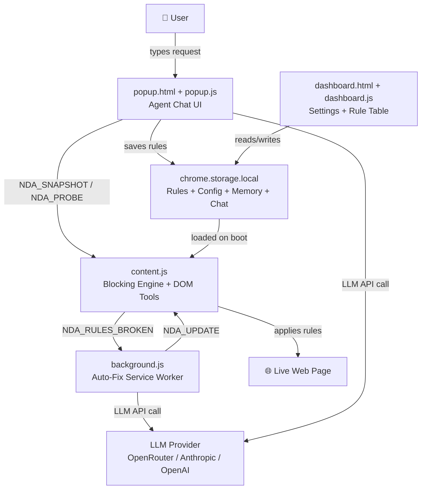

---

## Phase 1 — Basic Extension

### What was built
A minimal Chrome extension with `manifest.json`, a content script that injected CSS, and a popup with a list of hardcoded rule presets for common sites.

### Architecture at this point

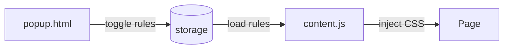

### Issues
- Rules were hardcoded — any site change broke them permanently
- CSS injection only ran on page load, missing dynamically loaded content
- No way to add custom rules without editing code

---

## Phase 2 — AI Chat Integration

### What was built
Added a chat interface in the popup. The user could describe what to hide and the LLM would return a CSS selector, which was saved as a rule.

### How AI was called

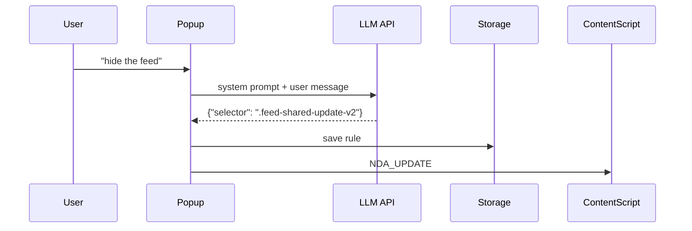

### Issues
- LLM returned a single CSS selector — no verification it actually worked
- If the selector was wrong, nothing happened silently
- Only Anthropic API was supported — locked to one provider

---

## Phase 3 — Security & Dashboard

### What was built
- Full dashboard page with rule table, provider/model selector, import/export
- API key stored as `password` field (masked in UI)
- **PIN encryption** — optional AES-256-GCM with PBKDF2 key derivation
- Forgot PIN flow using EmailJS for 6-digit code verification

### Encryption architecture

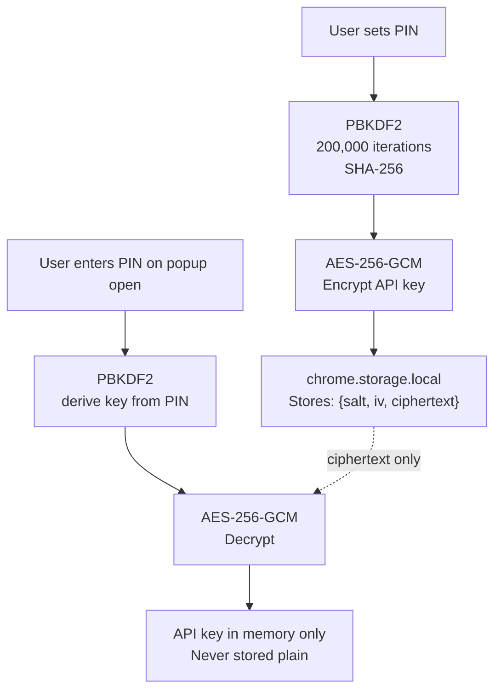

### PIN brute-force protection
- 5-second cooldown per failed attempt
- After 10 failures → 5-minute lockout
- State stored in `chrome.storage.session` (clears on browser restart)

### Issues
- Forgot PIN flow required EmailJS setup — non-trivial for personal use
- PIN mode prevents background auto-fix (can't decrypt without user)

---

## Phase 4 — Blocking Engine Overhaul

### Problem
CSS `display:none` rules were applied once but dynamic pages (SPAs using React/Vue) re-render the DOM constantly. New content loaded from scroll was not being blocked.

### Root causes identified

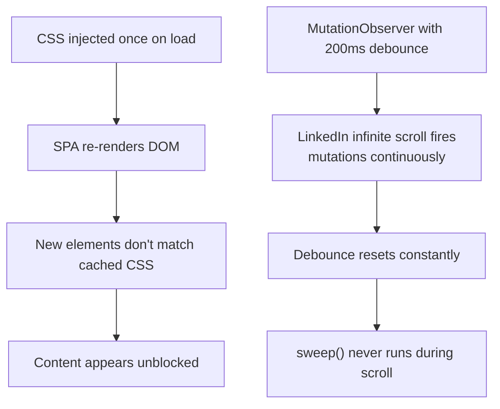

### Solution — dual-layer blocking engine

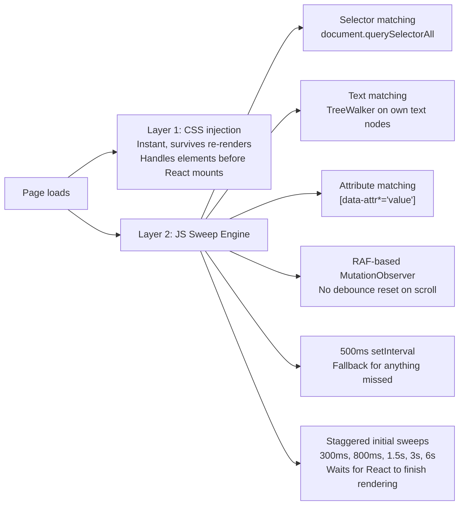

### Key fix — RAF instead of debounce
```
Before: new MutationObserver(() => { debounce(sweep, 200) })
        → debounce resets on every mutation during scroll
        → sweep never runs

After:  new MutationObserver(() => {
          if (rafQueued) return;
          rafQueued = true;
          requestAnimationFrame(() => { rafQueued = false; sweep(); });
        })
        → fires once per animation frame (~16ms)
        → never resets, always runs
```

---

## Phase 5 — Agentic Loop

### Problem
Single-shot LLM calls returned selectors that often didn't work — no verification, no iteration, no ability to adapt.

### What was built
A full agent loop where the LLM can use tools across multiple turns:

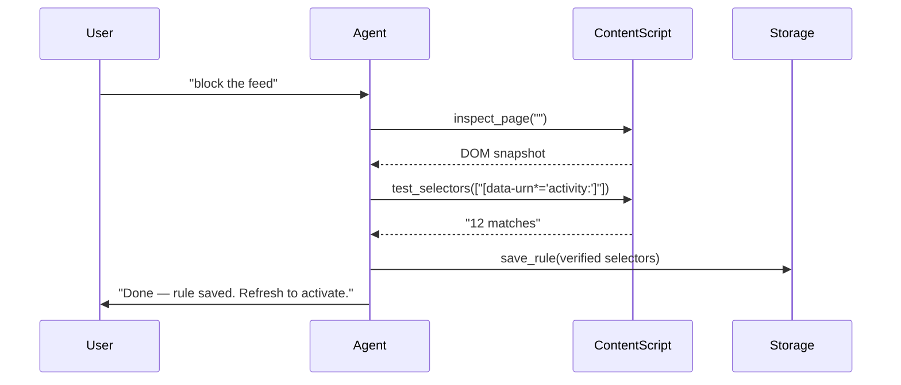

### JSON-based tool calling (provider-agnostic)

**Why not native tool calling?**  
Many models on OpenRouter (especially smaller/cheaper ones) claim to support tool calling but silently fall back to printing `<function=...>` as plain text. Native tool calling APIs also differ between Anthropic and OpenAI formats.

**Solution:** prompt-based JSON actions — the model outputs one JSON object per turn, we parse and execute it ourselves. Works with any model that can output valid JSON.

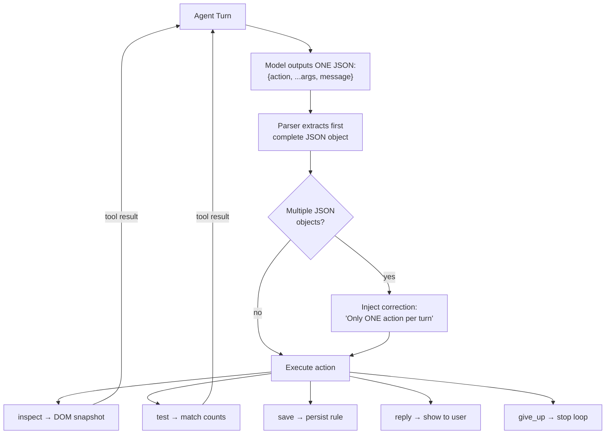

### Issue — model outputting multiple JSON objects
The model would write several `{action:...}` objects in one response, causing the loop to never execute any of them. Fixed by:
1. Parser walks character-by-character tracking brace depth to find first complete JSON
2. If multiple found, first is executed and a correction is injected for next turn
3. Prompt shows an explicit bad/good example with "FORBIDDEN" label

---

## Phase 6 — Persistence & Memory

### What was built

**Per-site agent memory** — up to 20 messages stored per domain in `chrome.storage.local`. Injected into system prompt so agent knows what it tried before, what worked, what failed.

```
nda_mem_youtube.com  → [{role, content, ts}, ...]
nda_mem_reddit.com   → [{role, content, ts}, ...]
```

**Per-site chat history** — up to 30 UI messages restored when popup reopens on same domain. The chat doesn't reset between tab switches or popup close/reopen.

```
nda_chat_youtube.com → [{role, html, ts}, ...]
```

### Memory injection in system prompt

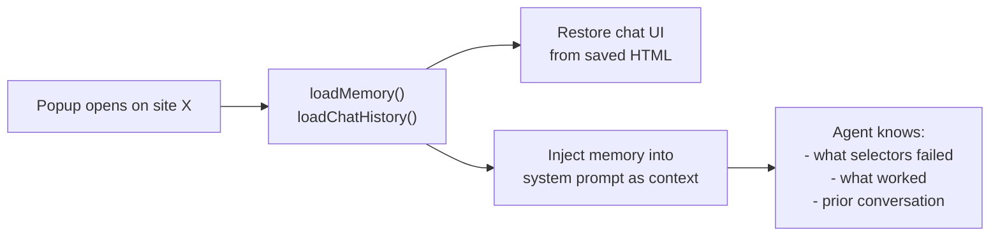

---

## Phase 7 — Self-Healing Auto-Fix

### What was built
The content script silently probes all active rules 3 seconds after page load. If any rule matches 0 elements, it reports to the background service worker. The background applies timing guards and runs an auto-fix agent loop without requiring the popup to be open.

### Auto-fix decision flow

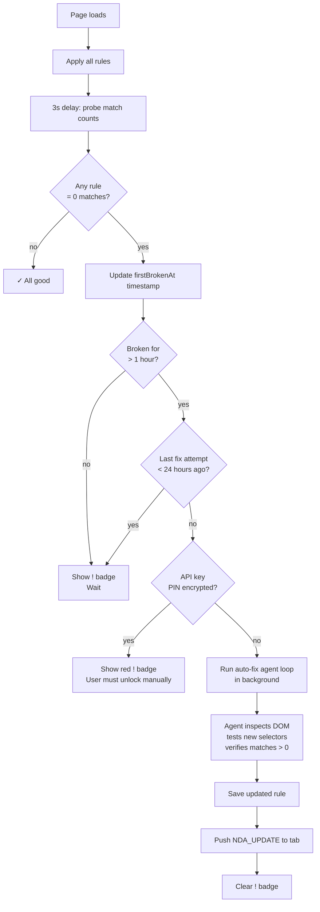

### Timing guard rationale
| Guard | Value | Reason |
|-------|-------|--------|
| First broken threshold | 1 hour | Filters slow page loads, race conditions |
| Fix cooldown per rule | 24 hours | Prevents runaway API calls if site is flaky |
| Probe delay | 3 seconds | Waits for React/SPA to finish initial render |

---

## Phase 8 — Rule Management & Text Blocking

### New agent tools

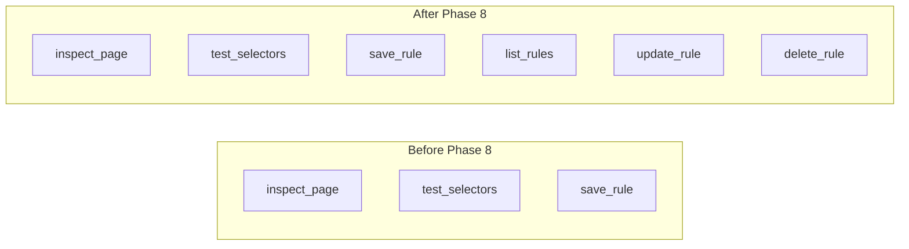

**Why this mattered:** when a user said "fix the previous rule," the agent had no access to existing rules and would create a duplicate instead of patching the original. Now:
- Current site rules are injected into every system prompt
- Agent calls `list_rules` to see rule IDs
- `update_rule` patches selectors/textContains in-place
- `delete_rule` removes a specific rule without touching others

### Text-based blocking — TreeWalker implementation

**Problem with the old approach:**
```
Old: root.children.forEach(el => {
  if (el.textContent.includes("Promoted")) hide(el)  // WRONG
})
// el.textContent includes ALL descendant text
// Regular posts mentioning "promoted" in body text would also match
```

**New approach — own-text-only matching:**
```
New: TreeWalker visits every element
     Checks only DIRECT text node children (not descendant text)
     "Promoted" label element → matched ✓
     Post body containing word "promoted" → NOT matched ✓
     Then climbs parentSteps levels up to hide the whole card
```

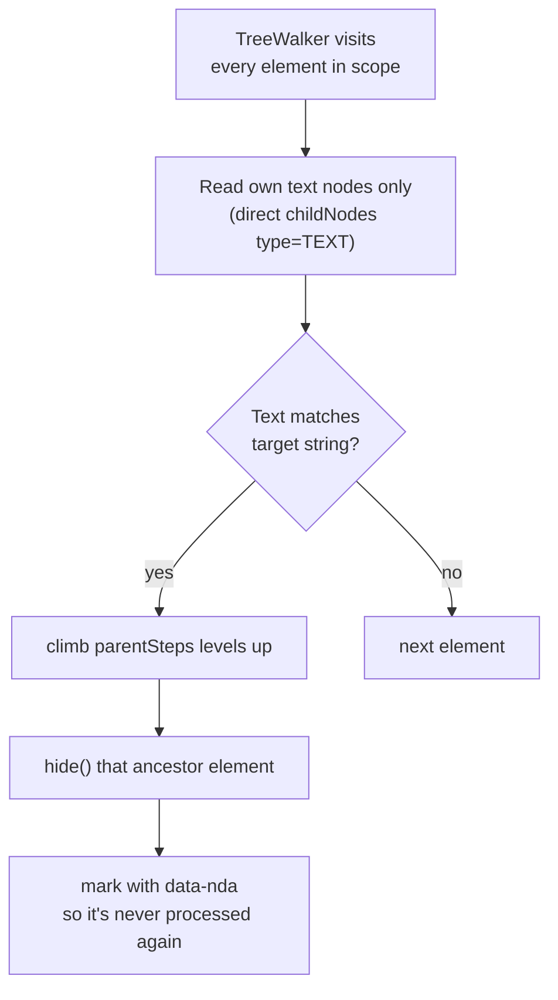

This runs every 500ms + on every DOM mutation via RAF observer, so every post that loads on scroll is checked immediately.

---

## Issues Faced & How They Were Solved

| # | Issue | Root Cause | Solution |
|---|-------|-----------|----------|
| 1 | Content not blocked after scroll | CSS injected once, SPA re-renders DOM | Added MutationObserver + 500ms polling + staggered sweeps |
| 2 | Observer never fired during scroll | Debounce reset on every mutation | Switched to RAF-based batching — fires once per frame, never resets |
| 3 | AI rules doing nothing | CSS not injected for jsRule rules | Fixed `injectCSS()` to collect selectors from both manual and AI rules |
| 4 | Toggle buttons not working | Per-element listeners destroyed on re-render | Switched to event delegation on parent container |
| 5 | Agent couldn't connect to page | Tab was open before extension loaded | Added `checkDOMAccess()` with programmatic script injection fallback |
| 6 | Agent loops and loops on connection error | No fallback when DOM unreachable | DOM_NOT_ACCESSIBLE flag → agent saves from built-in knowledge immediately |
| 7 | Agent outputs multiple JSON per turn | Model ignoring one-action-per-turn instruction | Improved prompt with explicit FORBIDDEN example + parser correction injection |
| 8 | Agent giving up too early | System prompt too permissive about giving up | Mandatory workflow with numbered steps, 8+ attempts before give_up allowed |
| 9 | `textContent` matching too broad | `textContent` returns all descendant text | TreeWalker checking only own direct text nodes |
| 10 | Agent can't edit existing rules | No list/update/delete tools existed | Added `list_rules`, `update_rule`, `delete_rule` + current rules injected into context |
| 11 | Dashboard inaccessible | Apostrophe in `I'll` broke JS string literal | Fixed quote escaping, added `node --check` validation to build process |
| 12 | Chat reset between popup opens | No persistence for UI messages | Added `nda_chat_[host]` storage key, restores on `finishInit()` |
| 13 | Auto-fix triggers too aggressively | No timing guards | 1-hour broken threshold + 24-hour cooldown per rule |

---

## Final File Map

```
no-distraction-ai/
├── manifest.json          Chrome extension config — MV3, permissions, content scripts
├── background.js          Service worker — auto-fix loop, badge management, timing guards
├── content.js             Injected into every page — CSS + JS blocking engine, DOM tools for agent
├── popup.html             Extension popup UI — chat, rules tab, PIN screen
├── popup.js               Agent loop — JSON tool calling, memory, chat persistence, PIN auth
├── dashboard.html         Full-page settings UI — API config, PIN management, rule table
├── dashboard.js           Dashboard logic — rule CRUD, provider/model switching, import/export
├── crypto-utils.js        AES-256-GCM + PBKDF2 — shared between popup and dashboard
└── icons/                 Extension icons (16px, 48px, 128px)
```

### Storage keys used

| Key | Contents | Scope |
|-----|----------|-------|
| `nda_rules` | All blocking rules | Persistent |
| `nda_api_key` | Plain API key (no PIN mode) | Persistent |
| `nda_api_key_enc` | Encrypted API key (PIN mode) | Persistent |
| `nda_config` | Provider, model, baseUrl, pinMode | Persistent |
| `nda_recovery` | EmailJS credentials for forgot-PIN | Persistent |
| `nda_autofix_state` | Per-rule broken timestamps | Persistent |
| `nda_mem_[host]` | Per-site agent memory (20 msgs) | Persistent |
| `nda_chat_[host]` | Per-site chat UI history (30 msgs) | Persistent |
| `nda_pin_attempts` | Failed PIN count | Session only |
| `nda_pin_lockout_until` | Lockout timestamp | Session only |

---

## Key Technical Decisions

### Why JSON-based tool calling over native tool APIs
Native tool calling (Anthropic `tools`, OpenAI `tools`) requires the model to actually support it — many models on OpenRouter silently fall back to printing raw XML tags. JSON-based tool calling works with any model that can output valid JSON, which is nearly all of them.

### Why RAF over debounce for MutationObserver
Debounce with a fixed delay resets on every mutation. Infinite-scroll sites fire mutations continuously during scroll, so the debounce timer never expires. `requestAnimationFrame` fires exactly once per animation frame (~16ms) regardless of how many mutations occurred — fast enough to feel instant, never blocked by scroll events.

### Why dual-layer CSS+JS blocking
CSS is processed by the browser's rendering engine before JavaScript runs and before React mounts components — it provides instant first-paint blocking. The JS engine handles everything CSS can't: parent traversal, text matching, attribute patterns, and the continuous sweep for dynamically loaded content. CSS covers the static case; JS covers the dynamic case.

### Why per-site memory and chat history
Context is everything for an agentic loop. Without memory, the agent repeats the same failed selector attempts on every conversation. With memory, it knows which approaches failed on this specific site and can skip straight to what works. Chat history makes the tool feel like a persistent assistant rather than a stateless command line.
